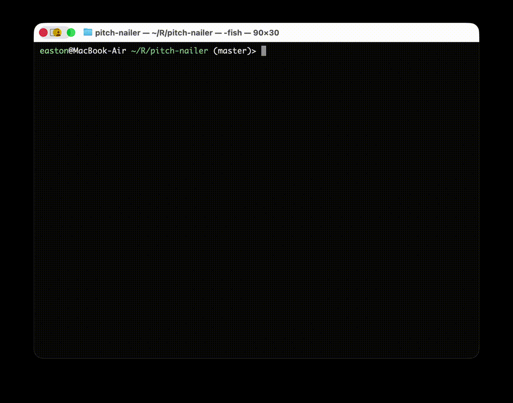

# Pitch Nailer

一个实时音高检测工具，能够通过麦克风输入检测音高并显示音符名称、音分偏移和频率信息。

## 使用方法

```bash
cargo run
```
输出示例：


## 实现原理

### 主要依赖库

| 库名                | 版本   | 作用                                                    |
| ------------------- | ------ | ------------------------------------------------------- |
| **cpal**            | 0.15.3 | 跨平台音频库，负责音频输入设备的管理和音频流的处理      |
| **pitch-detection** | 0.3.0  | 音高检测库，提供YIN算法实现用于从音频信号中提取音高信息 |


### 算法

利用capl库获取音频输入流，并使用pitch-detection库中的YIN算法进行音高检测，最后将检测结果转换为音符名称、音分偏移和频率信息进行显示。
